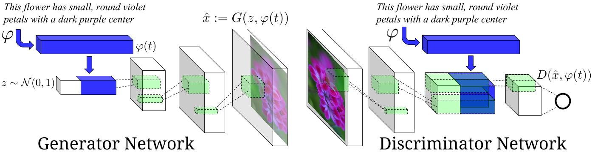

# Project Name

This is my essay  on Generative Adversarial Text-to-Image Synthesis paper. I made a Pytorch Implementation of the network made by the author that you can find here [Link Author's repository](https://github.com/reedscot/icml2016). 

I used the CUB dataset to train the network. You can find the [embeddings](https://drive.google.com/file/d/0B0ywwgffWnLLLUc2WHYzM0Q2eWc/view?usp=sharing). For the texts and images, they are available on this [Kaggle](https://www.kaggle.com/datasets/wenewone/cub2002011) page

---

## Overview

This project is based on the paper:

>Authors : Scott Reed, Zeynep Akata, Xinchen Yan, Lajanugen Logeswaran, Bernt Schiele, Honglak Lee , *Generative Adversarial Text to Image Synthesis*, University of Michigan, Ann Arbor, MI, USA (UMICH.EDU), 05 June 2016.

You can find the paper here:  
[Paper Link](https://arxiv.org/pdf/1605.05396)

---
## References Repositories
For the dataset and cls algorithm : https://github.com/snow-mn/GAN-INT-CLS

For the Network : https://github.com/reedscot/icml2016/tree/master
